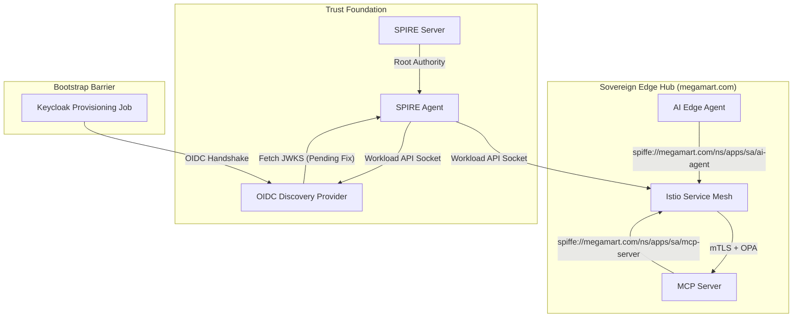

# 🛰️ Sovereign Edge Identity: Unified 16,000-Store Fleet

An enterprise-scale Agentic AI infrastructure designed for 16,000 national edge stores, anchored by a **Unified SPIRE-as-CA** identity model. This project enforces cryptographically consistent zero-trust across the entire mesh, enabling sovereign AI agents to operate with high-fidelity identity under the `megamart.com` trust domain.

## 📐 High-Fidelity Architecture
This project uses **SPIRE** as the root of trust, delegating certificate issuance for the Istio service mesh and ensuring 100% cryptographic consistency from the edge to the core.



## 🏗️ Technical Progress (megamart.com)
- **Unified Domain**: Successfully migrated all mesh components to the `megamart.com` trust domain.
- **Citadel Bypass**: Identity issuance is fully delegated to SPIRE, eliminating the "Two-Identity Problem."
- **Standardized Anchors**: Aligned the entire fleet to a standardized node socket path at `/run/spire/agent-sockets/`.
- **Identity Verification**: Confirmed the Provisioning Job's identity as `spiffe://megamart.com/ns/megamart-store-edge/sa/keycloak-provisioner`.

## 🛑 Current Status: The "Sovereign Frontier"
We have successfully built the Unified Identity foundation, but are currently analyzing a **Bootstrap Barrier** in the OIDC Discovery Provider. 

### The Challenge
The OIDC provider (containerized) is currently unable to bridge its internal handshake to the node's SPIRE socket despite volume mount bridging. This prevents the final forging of the `megamart-edge` identity realm.

### The Problem Statement
- **ConfigMap Resistance**: Helm chart templates are currently resisting the socket path overrides required for the Discovery Provider binary.
- **Orchestration Lag**: At 16,000-store scale, the "Bootstrap Job" requires a definitive OIDC heartbeat which is currently in a manual stabilization phase.

---

## 🚀 Setup Guide (Flawless Manual Sequence)

### Stage 1: The Great Forge (Build Containers First) 🏗️
```bash
# Build AI Agent, MCP Server, and Webapp
./build_images.sh 
```

### Stage 2: Core Mesh Infrastructure 🛡️
```bash
terraform init
terraform apply -auto-approve
```

---

## 📺 Verification: The Agentic Handshake
1.  Navigate to the **Store Associate Tablet** at `http://localhost:30000`.
2.  Login via Keycloak (Link in UI).
3.  Enter the prompt: `"show list of orders"`.

---
**Repository State**: Unified Trust Achieved | Handshake Pending 🛡️🦾
