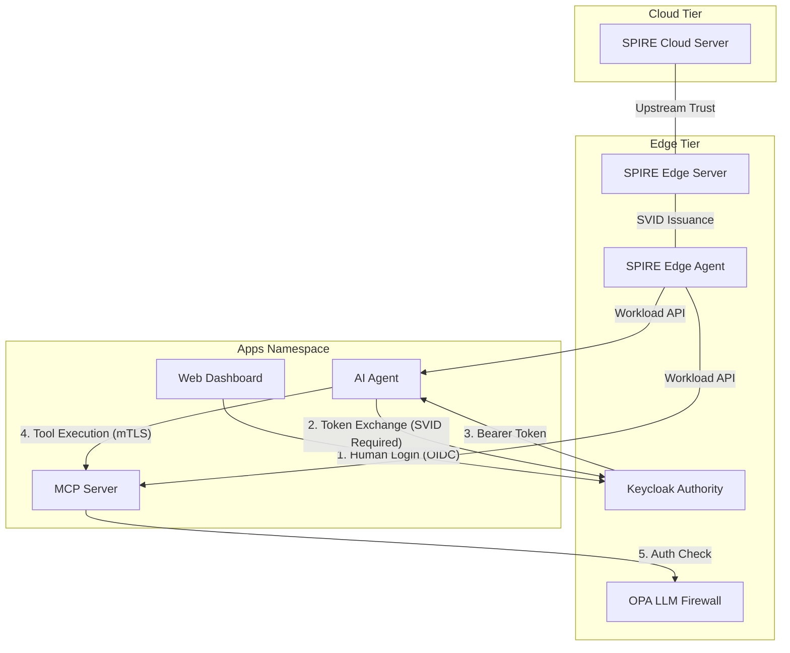

# Offline-First Edge Agentic AI System

This repository demonstrates a Zero Trust architecture for an AI Agent running at the edge, utilizing SPIFFE/SPIRE for workload identity, Keycloak for RFC 8693 Token Exchange, and the Model Context Protocol (MCP) for tool execution.

## Architecture & Security Philosophy
This system is designed for **Offline-First Resilience**. By running dedicated SPIRE and Keycloak instances at the edge, the system can continue to authenticate users and verify high-stakes AI tool executions even during a complete cloud outage.

### Layered Security Model
- **Identity Independence**: SPIRE is the root of trust, sitting outside the mesh.
- **Automated mTLS**: Istio sidecars fetch SPIFFE identities from SPIRE for encryption.
- **Down-scoped Authorization**: AI Agent uses RFC 8693 Token Exchange to prevent "Agent God Mode."
- **LLM Firewall**: OPA validates both AI identity and human role at the mesh layer.

---

## 🚀 Setup Guide (Flawless Manual Sequence)

To ensure a successful setup from a fresh cluster, follow these stages in order.

### Prerequisites
- **Rancher Desktop** (with Kubernetes enabled).
- `terraform`, `docker`, and `kubectl`.

---

### Stage 1: The Great Forge (Build Containers First) 🏗️
Because our deployments use `imagePullPolicy: Never`, you **must** build the application containers into your local registry before starting the infrastructure.

```bash
# 1. Build AI Agent
cd ai-agent-backend
docker build -t ai-agent-backend:latest .
cd ..

# 2. Build MCP Server
cd mcp-server
docker build -t mcp-server:latest .
cd ..

# 3. Build Webapp Frontend
cd webapp-frontend
docker build -t webapp-frontend:latest .
cd ..
```

---

### Stage 2: Core Mesh Infrastructure 🛡️
This stage deploys the Zero Trust foundations (SPIRE, Istio, OPA) and the Application layer (AI Agent, MCP Server, Frontend) in a single automated flow.

```bash
terraform init
terraform apply -auto-approve
```

*Wait ~3-5 minutes for all pods in `megamart-store-apps` and `megamart-store-edge` to reach the `Running` state.*

---

### Stage 3: Zero Trust Identity Authority 🔐
Configure the Keycloak realm and authorize the AI Agent for RFC 8693 Token Exchange.

```bash
cd terraform-keycloak
terraform init
terraform apply -auto-approve
cd ..
```

---

## 📺 Verification: The Agentic Handshake
1.  Navigate to the **Store Associate Tablet** at `http://localhost:30000`.
2.  Login via Keycloak (Link in UI).
3.  Enter the prompt: `"show list of orders"`.
4.  **Success**: The AI Agent will successfully perform a token exchange and fetch real-time order data through the secured mesh.

---

## Zero Trust Edge AI: The Sovereignty Framework 🛰️🛡️

> **"Identity is the new perimeter. Local trust is the new survival."**

This project demonstrates a production-grade **Zero Trust Edge AI** deployment. It solves the critical challenge of securing autonomous AI agents that must operate at the "Edge" where cloud connectivity is intermittent but security requirements are absolute. 

## 🌟 The Core Pillars
1.  **Verified Machine Identity**: Every workload (AI Agent, MCP Server) carries a cryptographic SPIFFE "Passport" (SVID) issued by a local SPIRE root-of-trust. IP addresses are irrelevant; only identity is absolute.
2.  **Context-Aware "Smart Gates"**: Our mesh distinguishes between **Human Browser Traffic** (Permissive) and **Machine-to-Machine Traffic** (Strict). Humans stay unblocked; machines are held to the highest cryptographic standards.
3.  **Offline-First Resilience**: By establishing a local identity hierarchy, the Edge Agent can continue to authorize and execute tools even when the Cloud Root of Trust is completely offline.

---

## 🏗️ Impact Architecture



### 1. Simulate Cloud Outage
Scale the cloud's root of trust to zero:
```bash
kubectl scale statefulset spire-cloud-server -n megamart-cloud-tier --replicas=0
```

### 2. Verify Edge Autonomy
- **Identity Check**: Run `kubectl logs -n megamart-store-edge -l app.kubernetes.io/name=agent` to see that the local agent is still serving SVIDs from its local cache.
- **Mission Check**: Go back to the Tablet UI and run `"show list of orders"` again. 
- **The Result**: The AI Agent continues to fetch orders flawlessly because the entire identity and authorization chain (SPIRE Agent -> Keycloak -> OPA) is running natively at the Edge.

---

## 🛡️ Operational Visibility
- **OPA Logs**: Monitor the "LLM Firewall" decisions:
  `kubectl logs -n megamart-store-edge -l app=opa --tail 20`
- **SPIRE Identities**: Check the AI Agent's SVID:
  `kubectl exec -it deployment/ai-agent -n megamart-store-apps -- /bin/sh`

## 🧹 Clean Up
For the cleanest state on Rancher Desktop, use the **Nuclear Option**:
1. Rancher Desktop -> Troubleshooting -> **Reset Kubernetes**.
2. Run `rm -rf .terraform* terraform.tfstate*` in the project root and `terraform-keycloak` directory.
