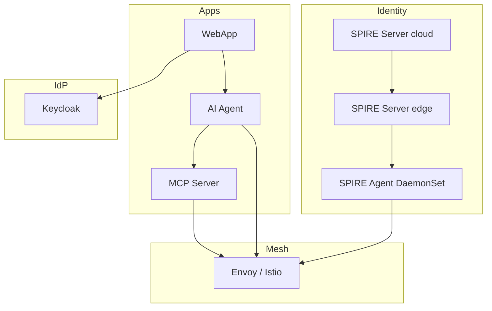

# Sovereign Edge Identity (SPIRE + Istio + OPA)

Enterprise-style playground for a **unified SPIRE-as-CA** identity model on Kubernetes: SPIRE is the workload identity authority, **Istio** uses the SPIRE Workload API for data-plane certificates, and **OPA** enforces ABAC on the MCP path. The trust domain is **`example.com`** (IANA-reserved; fictitious for this demo).

## Architecture (summary)



- **SPIRE (cloud)**: Root-ish authority in `edge-demo-cloud-tier`, OIDC discovery enabled for Keycloak integration.
- **SPIRE (edge)**: Subordinate server in `edge-demo-store-edge` upstream to cloud; trust bundle is synced into the edge namespace after Helm install.
- **Istio**: `istiod` in `istio-system`; mesh `trustDomain` and SPIFFE socket via `meshConfig.defaultConfig.proxyMetadata.SPIFFE_ENDPOINT_SOCKET` (see `istio-spire.tf`).
- **Workloads** (`edge-demo-store-apps`): `ai-agent`, `mcp-server`, `webapp-frontend` use local images with `imagePullPolicy: Never`, host-mounted SPIRE socket, and OPA sidecars fed from a `ConfigMap` that includes `policy.rego` plus optional GitHub bundle sync.

## Prerequisites

- **Kubernetes** with `kubectl` configured (defaults to context **`rancher-desktop`** — Rancher Desktop is a good fit).
- **Docker** (build host shares the daemon with the cluster on Rancher Desktop so `Never` pulls work).
- **Terraform** (>= 1.x).

## One-command bootstrap

From the repo root:

```bash
chmod +x bootstrap.sh
./bootstrap.sh
```

This runs `build_images.sh` (tags `ai-agent-backend:latest`, `mcp-server:latest`, `webapp-frontend:latest`) then `terraform init` and `terraform apply -auto-approve`.

### Custom cluster context

```bash
export KUBE_CONTEXT=my-context
./bootstrap.sh
```

If you use a non-default kubeconfig file (single path):

```bash
export KUBECONFIG=/path/to/config
./bootstrap.sh
```

Terraform variables mirror this: `kube_context`, `kubeconfig_path`, and `keycloak_url` (see `variables.tf`). The Keycloak provider uses **`http://localhost:30080`** by default because Keycloak is exposed with **NodePort 30080**; if you apply from a host that cannot reach the API on `localhost`, set `TF_VAR_keycloak_url` to a reachable URL (for example after `kubectl port-forward`).

### Manual steps (equivalent to bootstrap)

```bash
./build_images.sh
terraform init
terraform apply -auto-approve
```

## Verification

1. **Web UI**: `http://localhost:30000` (NodePort for `webapp-frontend`).
2. **Keycloak admin**: `http://localhost:30080` (admin / `edge_demo_admin_pass` — from Terraform).
3. Log in via the app flow and exercise the agent (e.g. “show list of orders”).

See **[README-MESH.md](README-MESH.md)** for Istio SPIRE SDS, OPA external authorization, and policy details.

## Repository layout

- `main.tf` — Namespaces, SPIRE Helm releases, trust-bundle sync, Keycloak, app deployments, Istio manifests.
- `istio-spire.tf` — Istio base + `istiod` with SPIFFE metadata and OPA `extensionProviders`.
- `policy.rego` — OPA policy (also embedded in the OPA `ConfigMap`).
- `spire/` — Vendored/reference SPIRE Helm chart subtree (upstream charts are pulled from `helm-charts-hardened` at apply time).
