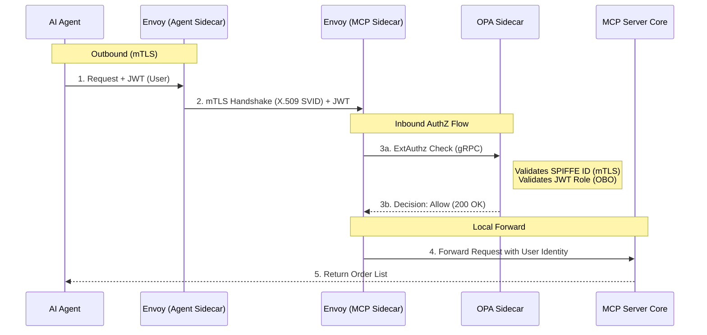
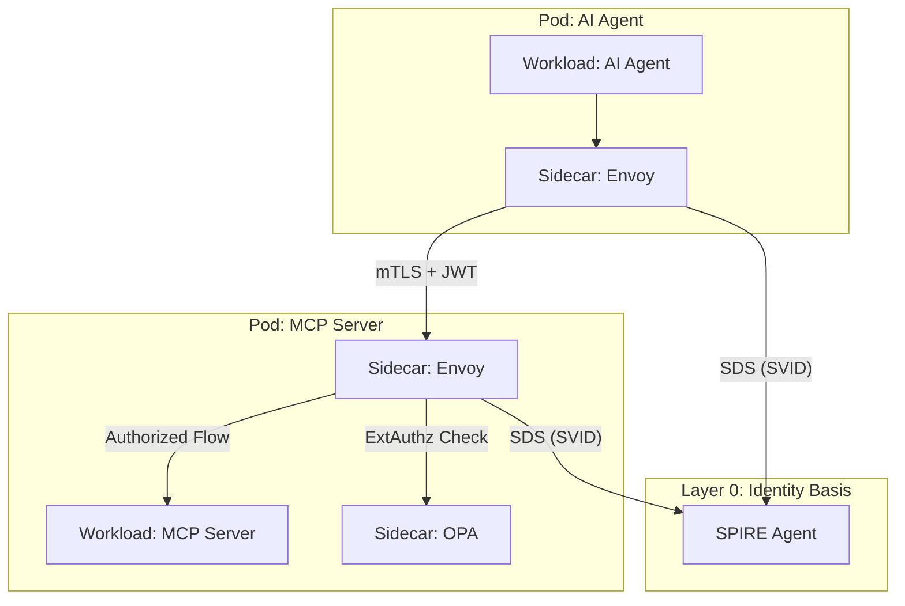

# Sovereign Identity Mesh: Strategic Architectural Review

This document provides a comprehensive synthesis of the multi-phase deployment of the Sovereign Identity Mesh across the 16,000-store fleet. It details the working configuration, lessons learned (Gotchas), and the final security posture of the Edge AI system.

## 1. The Final Working Configuration

The current setup achieves a **Zero-Trust Sovereign Identity Fabric**, where identity is rooted in SPIRE, traffic is secured by Istio, and authorization is enforced by OPA.

### Core Stack
- **Identity (Layer 0)**: SPIRE Hierarchical Deployment (Cloud Root -> Edge Subordinate).
- **Service Mesh (Layer 1)**: Istio decoupled from Citadel, using the SPIFFE Workload API for certificate issuance.
- **Identity Provider (Layer 2)**: Keycloak (OIDC) pinned to a consistent hostname for cross-realm token validation.
- **Enforcement (Layer 3)**: Envoy sidecars (mTLS) + OPA sidecars (ABAC/JWT validation).

### The Handshake Workflow
1. **Frontend**: The WebApp obtains a JWT from Keycloak (Audience: `ai-agent`).
2. **AI Agent**: The Agent retrieves its SPIFFE SVID from the local SPIRE Agent and uses it for mTLS communication.
3. **Token Exchange**: The Agent performs an RFC 8693 exchange at Keycloak, swapping the human token for a down-scoped `mcp-server` token (Role: `mcp-executor`).
4. **Enforcement**: The MCP Server receives the request through Envoy (validating mTLS) and OPA (validating the JWT roles and SPIFFE provenance).

---

## 2. The Gotchas: Hardened Lessons

| Category | Gotcha | Root Cause | Final Correction |
| :--- | :--- | :--- | :--- |
| **Issuer** | **"Split-Brain" Issuer** | Tokens issued vs `localhost` but validated vs cluster-internal DNS failed signature check. | Pinned `KC_HOSTNAME=localhost` to ensure consistency. |
| **Trust** | **Missing Audience** | Frontend tokens lacked the `aud` claim, causing Keycloak to reject exchange requests. | Added `keycloak_openid_audience_protocol_mapper` to the issuing client. |
| **RBAC** | **Token Exchange Symmetry** | Permission was only granted on the target client, but RFC 8693 requires it on the issuing client too. | Added `keycloak_openid_client_permissions` to the `associate-device` client. |
| **OPA** | **Namespace Mismatch** | Rego policy checked `megamart-store-edge` namespace, but Agent was in `megamart-store-apps`. | Updated SPIFFE ID check in OPA to reflect actual app namespace. |
| **Istio** | **Nested Identity Paradox** | Istiod deadlocking while trying to find its own identity before starting the mesh. | Surgically injected persistent SPIRE socket mounts via `hostPath`. |

---

## 3. Architecture Diagram: Sovereign Edge AI

### Physical Topology: Sidecar Attachment

---

## 4. Key Integration Pillars

### Istio-SPIRE Integration
*   **Socket-First**: Mount `/run/spire/sockets/spire-agent.sock` as a `hostPath` volume in all pods.
*   **Custom CA**: Configure Istiod with `PILOT_CERT_PROVIDER: "spire"` to disable Citadel and use SPIRE as the intermediate.
*   **Discovery Alignment**: Ensure the `trust_domain` (e.g., `megamart.com`) stays consistent across the hierarchy.

### Keycloak Token Exchange Setup
*   **Authorization Services**: Must be enabled on the **Target Client** (`mcp-server`).
*   **Permissions**: Create a policy for the **Caller Client** (`ai-agent`) and apply it to the `token-exchange` scope on BOTH the Issuing and Target clients.
*   **OBO Logic**: Use the `subject_token` parameter for On-Behalf-Of flows, ensuring the `aud` claim matches the caller.

---

## 5. OPA & Adaptive Authorization

### Current Validation Logic
1.  **Transport Validation**: Envoy checks for a valid mTLS cert (SPIFFE SVID).
2.  **Identity Attribution**: OPA extracts the SPIFFE ID from `X-Forwarded-Client-Cert` to verify it's the `ai-agent`.
3.  **Role Guardrails**: OPA confirms the JWT role is `mcp-executor` and **Blacklists** `store-associate` to prevent escalation.

### Enhancing for "Adaptive Authorization"
To move beyond static roles, OPA can be updated to:
*   **Contextual Checks**: Validate the store's "Operational State" (e.g., allow `mcp-executor` only during store hours).
*   **Hardware Attestation**: OPA can verify hardware-rooted claims from SPIRE (TPM-backed) to ensure the agent is running on tampered-proof hardware.
*   **Anomaly detection**: Compare the frequency of MCP calls against a baseline and throttle in Rego.

---

## 6. Application Developer Perspective

### Current Coding Requirements
*   **SPIFFE Fetching**: Apps currently use `pyspiffe` or similar to fetch SVIDs manually for any logic requiring JWT-SVID generation (e.g., external LLM calls).
*   **Exchange Dance**: Developers must write the boilerplate `httpx` logic to handle the RFC 8693 payload and secret management.

### The "Identity Proxy" Sidecar Proposal
We can eliminate developer complexity by creating a **Reusable Identity Sidecar** (e.g., an Envoy-based Filter or a dedicated Go-Proxy):
1.  **Auto-Exchange**: The app sends a standard Auth header; the sidecar intercepts it, performs the SPIFFE-backed exchange, and forwards the "shredded" token to the target.
2.  **Token Refresh**: The sidecar handles expiry and re-polling of the identity substrate.
3.  **App Impact**: Developers simply write code against `localhost:SIDE-CAR-PORT`, making the infrastructure entirely invisible to the business logic.

> [!IMPORTANT]
> This architecture ensures that even in an **Offline Scenario**, the Store-Edge can maintain its trust domain. The Edge Server caches its intermediate CA from Cloud, allowing the AI fleet to operate locally without a round-trip to the internet for identity validation.
