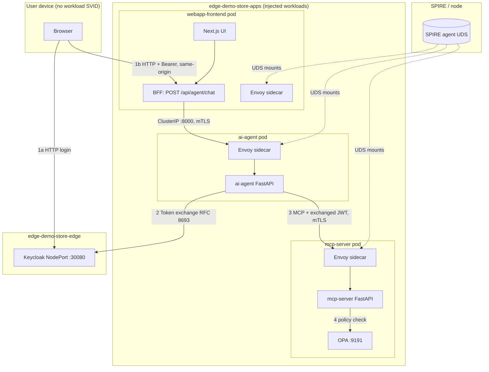

# Sovereign Identity Mesh: Strategic Architectural Review

This document synthesizes the **current** edge deployment: SPIRE-backed workload identity, Istio mTLS, Keycloak OIDC, a **browser-safe BFF** (webapp backend) in front of the AI agent, and **OPA** as the MCP tool gate. It also records lessons learned and the intended security posture.

## 1. Current Architecture (Summary)

The design aims at a **zero-trust service mesh** where **workload identity** is rooted in SPIRE, **transport** is Istio **mTLS** (SPIRE-fed proxy certificates), **humans** authenticate via Keycloak (OIDC), and **authorization** for MCP tool execution combines **JWT validation** (application) with **OPA policy** (SPIFFE provenance + downscoped roles).

### Core stack

| Layer | Components |
|-------|------------|
| **Trust / identity** | SPIRE Cloud → SPIRE Edge; Istio `trustDomain: example.com`; proxies use `SPIFFE_ENDPOINT_SOCKET` for certs. |
| **Mesh** | Istio **STRICT** mTLS mesh-wide; `PeerAuthentication` **PERMISSIVE** on **Keycloak** and **webapp** so browsers can use **HTTP NodePorts** for login and UI. |
| **OIDC** | Keycloak (`edge-demo` realm): human tokens carry `store-associate`; token exchange yields `mcp-executor` for MCP. |
| **Apps** | Next.js **webapp** (BFF route + static UI), **ai-agent** (FastAPI), **mcp-server** (FastAPI tools). Each injected workload gets an **Envoy** sidecar + **OPA** sidecar where configured. |

### Critical pattern: browser never calls the AI agent

The browser **does not** open `ai-agent` on a NodePort. It only talks to the **webapp** (same origin for chat):

1. **Login (exception path)**: Browser → **Keycloak** NodePort (`30080`) — password grant demo; transport is **plain HTTP** in this playground (PERMISSIVE on Keycloak).
2. **Chat**: Browser → **Webapp** NodePort (`30000`) → **Next.js route** `POST /api/agent/chat` → server-side `fetch` to **`ai-agent` Kubernetes Service** (`ClusterIP`, port 8000). That hop is **inside the mesh**: **webapp Envoy → ai-agent Envoy** (mTLS, SPIRE-backed SVIDs on the data plane).

`ai-agent` is exposed only as **ClusterIP** — no host NodePort — so it cannot be reached directly from the laptop browser.

### Request flow (happy path: MCP tool needed)

1. **Human JWT**: User token (role `store-associate`) is sent **only** to the webapp BFF (`Authorization: Bearer` on `/api/agent/chat`).
2. **BFF → ai-agent**: Next.js server forwards the same header to `http://ai-agent.<ns>.svc.cluster.local:8000/agent/chat` over the mesh.
3. **ai-agent**:
   - Validates the human JWT (JWKS, `store-associate`).
   - **LLM (stub)** decides whether an MCP tool is required (`llm_plan_mcp`); no token exchange if no tool.
   - Optionally obtains a SPIFFE JWT-SVID for future external LLM egress (not required for mesh hops).
   - **RFC 8693 token exchange** at Keycloak → downscoped token with **`mcp-executor`**, audience `mcp-server`.
   - Calls MCP JSON-RPC over mesh (`mcp-server:8001`).
4. **mcp-server**:
   - **JWT**: Validates signature via JWKS (cryptographic check).
   - **OPA**: `POST` to local OPA `http://127.0.0.1:9191/v1/data/authz/allow/mcp/messages` with `input` shaped like Envoy ext-authz (`authorization` + `x-forwarded-client-cert` headers). Policy enforces **ai-agent SPIFFE** in **XFCC** and **mcp-executor** / not **store-associate** in the bearer JWT (see `policy.rego`).
   - If OPA allows → tool handler runs.

### Visual architecture

**Transport note:** Istio sets **`meshConfig.defaultConfig.gatewayTopology.forwardClientCertDetails: APPEND_FORWARD`** so **`X-Forwarded-Client-Cert`** reaches the MCP app container; OPA policy uses it to assert the caller is **`spiffe://.../sa/ai-agent`**.

---

## 2. Configuration Details (Codebase)

| Topic | Implementation |
|-------|----------------|
| **Injection** | Namespace label `istio.io/rev=default` (Istio 1.29). |
| **SPIRE socket on proxies** | Annotations `sidecar.istio.io/userVolume` + `userVolumeMount` (JSON uses **`hostPath`**, not `host_path`). |
| **Istiod CA** | `global.pilotCertProvider: istiod` for control plane / webhook; data plane certs still from SPIRE via workload API. |
| **No custom Helm `spire` inject template** | Removed: merging partial `istio-proxy` fragments breaks Istio 1.29 injection (duplicate init / missing image). |
| **OPA** | `policy.rego` in ConfigMap; OPA started with **`--addr=:9191`** (default is **8181**, which broke localhost calls from the app). |
| **Global policy bundle** | `config.yaml` still pulls a GitHub bundle; local `policy.rego` is loaded explicitly for predictable MCP rules. |

---

## 3. Gotchas (Why Things Broke)

### Bootstrap / SPIRE bundle
Edge agents can fail if the trust bundle is stale vs Cloud. The repo uses trust sync patterns (see Terraform / `null_resource` history) so the edge agent trusts the cloud root before workloads start.

### Istio 1.29 injection merge
Custom sidecar injector templates that patch **`containers: [{name: istio-proxy, ...}]`** without a full image spec produced **invalid Pods** (`image` required, duplicate `istio-proxy` init names). Prefer **annotations** for SPIRE UDS volumes, not parallel templates.

### Browser vs STRICT mTLS
Humans cannot present SPIFFE SVIDs. **PERMISSIVE** on **webapp** and **Keycloak** remains necessary for **HTTP NodePort** access. **Service-to-service** traffic still uses **mTLS** between Envoy sidecars under **STRICT** defaults.

### ai-agent NodePort removal
Exposing **ai-agent** on the host forced **PERMISSIVE** on that workload so browsers could connect. Moving to **BFF + ClusterIP** restores **STRICT**-friendly access (only mesh clients).

### OPA port mismatch
OPA’s default listen address is **:8181**. The mesh and apps were configured for **9191**; without **`--addr=:9191`**, the MCP server’s OPA client failed with connection errors.

### OPA vs cryptographic JWT
`policy.rego` uses **`io.jwt.decode`** (claims only). **JWKS verification** remains in **FastAPI** before OPA is consulted.

---

## 4. Split Personality: Browser vs Mesh

| Path | Typical transport in this playground | Notes |
|------|--------------------------------------|--------|
| Browser → Keycloak | HTTP NodePort | “First login” / token grant. |
| Browser → Webapp | HTTP NodePort | Same-origin `/api/agent/chat`. |
| Webapp → ai-agent | **mTLS** (Envoy) | ClusterIP, no browser hop. |
| ai-agent → Keycloak / MCP | **mTLS** (Envoy) | Token exchange and tool calls. |

Production would add **TLS** (or HTTPS) in front of the browser-facing services; workload **SVIDs** remain on the mesh proxies, not in the browser.

---

## 5. Cloud-Outage Edge Survival

SPIRE CA TTL and local Keycloak/DB deployment allow extended **offline-style** operation at the edge (see earlier fleet design). The exact TTL values live in SPIRE / Helm configuration in this repo.

---

## 6. Future Engineering

- **Real LLM**: Replace `llm_plan_mcp` with an external model; keep token exchange **after** the model decides tool use.
- **Ingress + TLS**: Terminate HTTPS at a gateway; optional mutual TLS for enterprise-managed devices.
- **Envoy `ext_authz` to OPA**: Today MCP calls OPA over **localhost**; alternatively wire **`AuthorizationPolicy`** with `CUSTOM` + `opa-ext-authz` so Envoy invokes OPA (same policy bundle).
- **GitOps for policy**: Continuous delivery of `policy.rego` to clusters.
- **Federated trust domains** for store-level isolation.

---

## 7. Application Developer Perspective

- **BFF**: Frontend developers send **`Authorization`** only to **`/api/agent/chat`**; they must **not** embed `ai-agent` URLs in client-side code.
- **ai-agent**: Validates human token, runs LLM decision stub, performs **token exchange**, calls MCP with **mcp token**.
- **MCP**: Keep JWKS validation; **OPA** is the policy gate for tool execution (SPIFFE + roles).
- **SPIFFE JWT**: Still available for **external** LLM providers (egress), not for replacing mesh mTLS internally.

This architecture keeps **human OIDC**, **workload SPIFFE**, and **policy (OPA)** in separate layers while ensuring the **browser attack surface** is limited to the **webapp** and **Keycloak** endpoints you deliberately expose.
