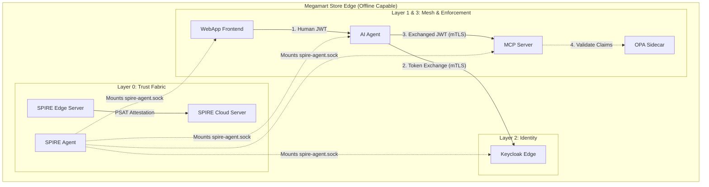

# Sovereign Identity Mesh: Strategic Architectural Review

This document provides a comprehensive synthesis of the multi-phase deployment of the Sovereign Identity Mesh across the 16,000-store fleet. It details the working configuration, lessons learned (Gotchas), and the final security posture of the Edge AI system.

## 1. The Final Working Configuration

The current setup achieves a **Zero-Trust Sovereign Identity Fabric**, where identity is rooted in SPIRE, traffic is secured by Istio, and authorization is enforced by OPA.

### Core Stack
- **Identity (Layer 0)**: SPIRE Hierarchical Deployment (Cloud Root -> Edge Subordinate).
- **Service Mesh (Layer 1)**: Istio decoupled from Citadel, using the SPIFFE Workload API for certificate issuance.
- **Identity Provider (Layer 2)**: Keycloak (OIDC) pinned to a consistent hostname for cross-realm token validation.
- **Enforcement (Layer 3)**: Envoy sidecars (mTLS) + OPA sidecars (ABAC/JWT validation).

### The Handshake Workflow
1. **Frontend**: The WebApp obtains a human-scoped JWT from Keycloak (Audience: `ai-agent`).
2. **AI Agent**: The Agent retrieves its SPIFFE SVID from the local SPIRE Agent and uses it for strict mTLS communication.
3. **Token Exchange**: The Agent performs an RFC 8693 token exchange at Keycloak, swapping the human token for a down-scoped `mcp-server` token (Role: `mcp-executor`).
4. **Enforcement**: The MCP Server receives the request through Envoy (validating the mTLS transport) and OPA (validating the JWT roles and SPIFFE provenance).

### Visual Architecture

---

## 2. The "Gotchas" (Why It Kept Breaking)

### The Bootstrap Paradox (Nested Identity)
**The Bug**: The `spire-edge-agent` was caught in a `CrashLoopBackOff`, causing all application sidecars to hang in `Init:0/2`.
**The Reality**: Helm deployed a stale `spire-bundle` for the agent. When the Edge Server got its new Cloud-signed identity, the Agent rejected it because its local bundle didn't know about the Cloud CA.
**The Fix**: Implemented the **Bundle Bridge**. We wrote a Terraform provisioner to extract the root trust bundle from the Cloud Server and forcefully inject it into the Edge namespace *before* the Agent boots.

### The OIDC Helm Abstraction Barrier
**The Bug**: OIDC Discovery was failing because the pod couldn't mount our custom socket path (`/run/spire/agent-sockets`).
**The Reality**: The SPIRE Helm chart hardcoded the `volumeMounts` for the OIDC provider, preventing us from overriding the paths via simple Helm values.
**The Fix**: **Direct Manifest Injection**. We disabled the Helm-managed OIDC provider and deployed it natively using a Terraform `kubernetes_deployment`, giving us absolute control over the host paths.

### The Double-Wrapping JWT Trap
**The Bug**: We tried passing a SPIFFE JWT as an `actor_token` inside the Keycloak token exchange payload.
**The Reality**: Keycloak rejected it (`invalid_token`) because we were "double-wrapping." We had not federated SPIRE as an external Identity Provider in Keycloak.
**The Fix**: We stripped the JWT from the Keycloak payload and now rely exclusively on Istio's mTLS (which already authenticates the SPIFFE machine identity via X.509) for the internal Keycloak call. The SPIFFE JWT is reserved entirely for external egress (e.g., calling external LLM providers).
**The Nuance (Why OIDC Discovery is Still Running)**: Even though mTLS handles internal app-to-app transport, the Native SPIFFE OIDC Discovery Provider remains critical. It ensures that OPA, external APIs, and eventually Keycloak (if fully federated) can cryptographically validate the signatures of any SPIFFE JWTs used for granular claim checks or external egress outside the boundaries of the mesh.

---

## 3. The "Split-Personality" Ingress

**The Problem**: Human browsers (laptops, phones) cannot participate in SPIRE mTLS because they don't have a local Workload API or an SVID. If the mesh is universally `STRICT`, humans are locked out.
**The Solution**: We applied an Istio `PeerAuthentication` policy to Keycloak and the WebApp frontend set to `PERMISSIVE`. 
- **Browser -> WebApp**: Standard HTTP/TLS.
- **WebApp -> Keycloak (Backend)**: STRICT mTLS.
- **WebApp -> AI Agent**: STRICT mTLS.

---

## 4. Cloud-Outage Edge Survival (The Offline Store)

**The Problem**: A standard nested SPIRE topology relies on short-lived intermediate certificates. If the Cloud goes down, the Edge Server stops issuing certs within hours, taking the store down with it.
**The Architecture**: We extended the SPIRE CA TTL to `336h` (14 days) on both Cloud and Edge servers. 
**The Local Topology**: Because Keycloak and its PostgreSQL database replica are deployed locally within the `megamart-store-edge` namespace alongside the apps, the entire AuthZ/AuthN pipeline can execute locally without reaching back to the cloud.
**The Result**: If the store loses internet connection, the Edge Server can continue to mint and rotate SVIDs for local workloads, and Keycloak can continue to exchange tokens locally, for up to two weeks completely autonomously.

---

## 5. Future Engineering: Beyond the MVP

To take this from a playground to a production-grade 16,000-store rollout, the following architectural additions are recommended:

### Federated Trust Domains (SPIRE Federation)
Instead of a single `megamart.com` trust domain, implement independent domains (e.g., `store001.megamart.local`) that federate with the Cloud. This prevents a compromised store from impersonating another store.

### Automated Policy Distribution (GitOps)
Currently, OPA policies are pulled via an init container or static ConfigMap. We need to implement a sync agent (like `kube-mgmt` or Flux) to push `policy.rego` updates directly to the edge nodes in real-time.

### Advanced OPA Rules
* **Hardware Attestation**: OPA can verify hardware-rooted claims from SPIRE (TPM-backed) to ensure the agent is running on tampered-proof hardware.
* **Anomaly detection**: Compare the frequency of MCP calls against a baseline and throttle in Rego.

---

## 6. Application Developer Perspective

### Current Coding Requirements
* **SPIFFE Fetching**: Apps currently use `pyspiffe` or similar to fetch SVIDs manually for any logic requiring JWT-SVID generation (e.g., external LLM calls).
* **Exchange Dance**: Developers must write the boilerplate `httpx` logic to handle the RFC 8693 payload and secret management.

### The "Identity Proxy" Sidecar Proposal
We can eliminate developer complexity by creating a **Reusable Identity Sidecar**. This could be implemented by leveraging Envoy's native `ext_authz` filter, a lightweight reverse-proxy like OAuth2-Proxy, or a custom Go binary:
1.  **Auto-Exchange**: The application sends a standard Authorization header; the sidecar intercepts it, performs the SPIFFE-backed exchange with Keycloak, and forwards the "shredded" down-scoped token to the target.
2.  **Token Refresh**: The sidecar handles expiry and re-polling of the identity substrate.
3.  **App Impact**: Developers simply write code against `localhost:SIDE-CAR-PORT`, making the complex identity infrastructure entirely invisible to the business logic.

> [!IMPORTANT]
> This architecture ensures that even in an **Offline Scenario**, the Store-Edge can maintain its trust domain. The Edge Server caches its intermediate CA from Cloud, allowing the AI fleet to operate locally without a round-trip to the internet for identity validation.